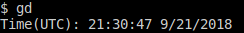

# Introduction to xv6

Three features were added to the operating system.


**getdate system-call:** 
```
Read CMOS Real-Time-Clock registers.
```
**setdate system-call:**
```
Program CMOS Real-Time-Clock registers.
```
The system calls 

**Exit status:**

```
Implement process exit status support.
```

## Running the tests

**getdate system-call:**
The test for the getdate system-call simply reads the current cmos rtc registers and sends the values to standard output. 
The time is presented in UTC (Coordinated Universal Time).
The program is called **gd**. 

**Example:**


**setdate system-call:**
The test for the setdate system-call writes a correct value tot he cmos rtc registers when no arguments are passed to the program, and then uses the getdate system-call to read the register values and print them. When any argument is passed to the program, a wrong date and time is sent to modify the cmos rtc registers (it fails) an exit code 1.

**Example:**


**Exit status - Process killed**
The exit status is tested and checked by the setdate system-call shown above. It is also tested to see if a process has been killed. If a process is killed the exit status is -1 and the sh command prints the word "Killed".

**Example**

